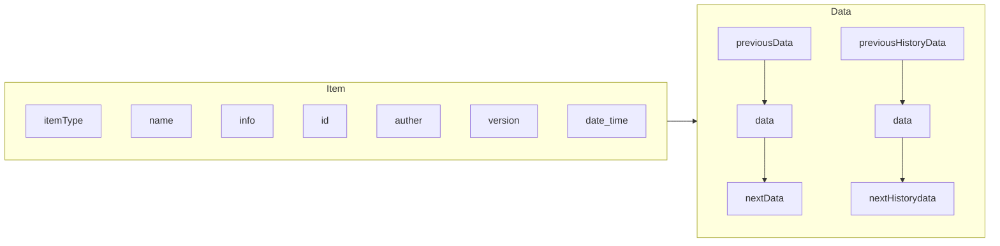
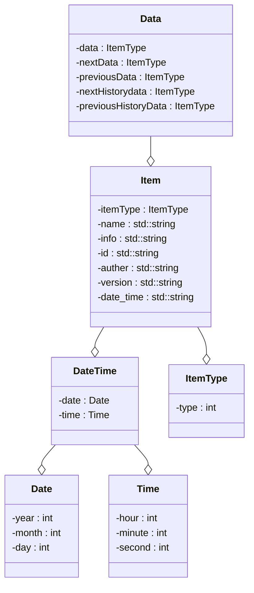
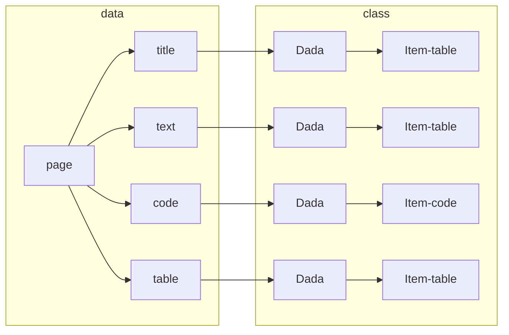
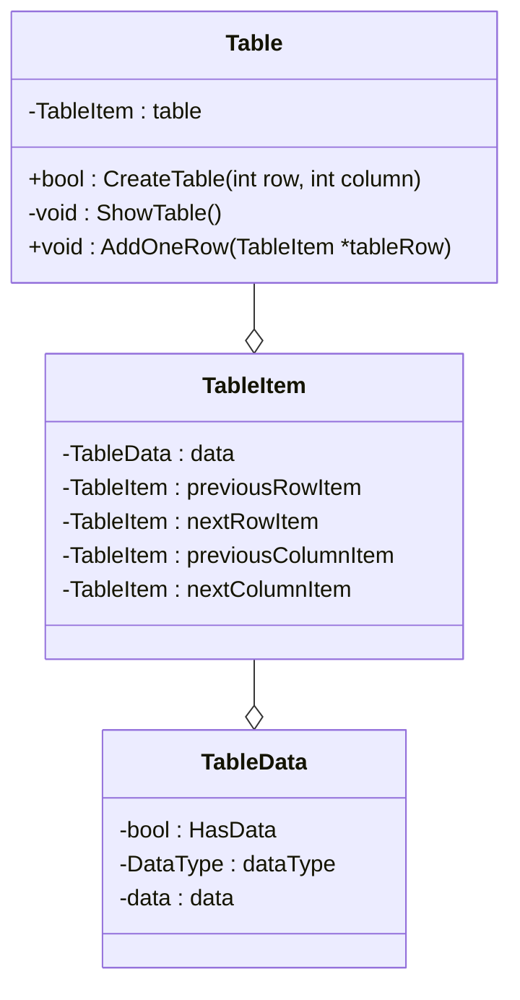

# MyNotion

```mermaid
flowchart LR
	subgraph Item
		I1[itemType]
		I2[name]
		I3[info]
		I4[id]
		I5[auther]
		I6[version]
		I7[date_time]
	end
	subgraph Data
		D1[data]
		D11[data]
		D2[nextData]
    		D3[previousData]
    		D4[nextHistorydata]
    		D5[previousHistoryData]
		D1 --> D2
		D3 --> D1
		D11 --> D4
		D5 --> D11

	end
	Item --> Data
```

```mermaid
classDiagram
  	direction TB
  		class Time {
    			-hour : int
			-minute : int
			-second : int
  		}
		class Date {
    			-year : int
			-month : int
			-day : int
  		}
		class DateTime {
    			-date : Date
			-time : Time
  		}
		class Item {
    			-itemType : ItemType
    			-name : std::string
    			-info : std::string
    			-id : std::string
    			-auther : std::string
    			-version : std::string
    			-date_time : std::string
  		}
		class ItemType {
			-type : int
		}
		class Data {
			-data : ItemType
			-nextData : ItemType
			-previousData : ItemType
			-nextHistorydata : ItemType
			-previousHistoryData : ItemType
		}
		Data --o Item
		Item --o DateTime
		Item --o ItemType
		DateTime --o Date
		DateTime --o Time
```

# Object

* create page

```mermaid
  flowchart LR
  	A[page]
  	B1[title]
  	B2[text]
  	B3[code]
  	B4[table]
  	C1[Dada]
  	C2[Dada]
  	C3[Dada]
  	C4[Dada]
  	D1[Item-table]
  	D2[Item-table]
  	D3[Item-code]
  	D4[Item-table]

  	subgraph data
  		A --> B1
  		A --> B2
  		A --> B3
  		A --> B4
  	end
  	subgraph class
		B1 --> C1
  		B2 --> C2
  		B3 --> C3
  		B4 --> C4
  		C1 --> D1
  		C2 --> D2
  		C3 --> D3
  		C4 --> D4
  	end

```

## Table

```mermaid
classDiagram
  	direction TB
  		class Table {
    		-TableItem : table
			+bool : CreateTable(int row, int column)
			-void : ShowTable()
			+void : AddOneRow(TableItem *tableRow)
  		}
		class TableItem {
    		-TableData : data
			-TableItem : previousRowItem
			-TableItem : nextRowItem
			-TableItem : previousColumnItem
			-TableItem : nextColumnItem
  		}
		class TableData {
    		-bool : HasData
			-DataType : dataType
			-data : data
  		}

		Table --o TableItem
		TableItem --o TableData

```

# MarkDown Item

page

Title

text

code

table

image
