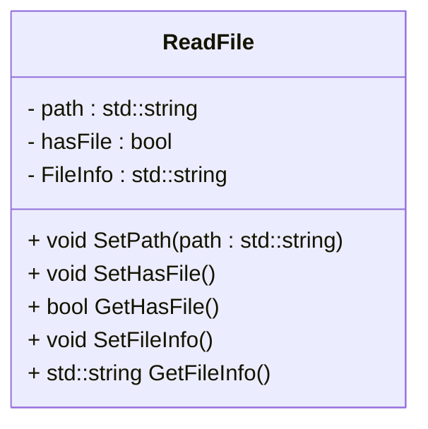

# ReadFile

# Class Diagram

```mermaid
classDiagram
  	direction TB
  		class ReadFile {
    			- path : std::string
			- hasFile : bool
			- FileInfo : std::string
			+ void SetPath(path : std::string)
			+ void SetHasFile()
			+ bool GetHasFile()
			+ void SetFileInfo()
			+ std::string GetFileInfo()
  		}

```

11
